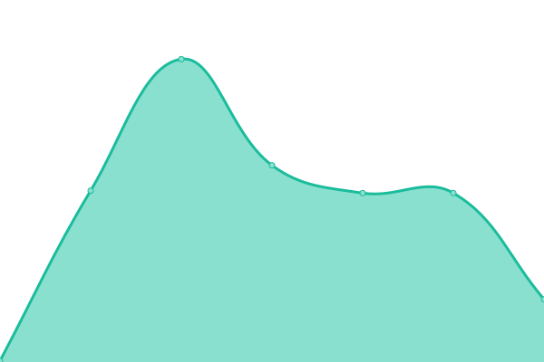
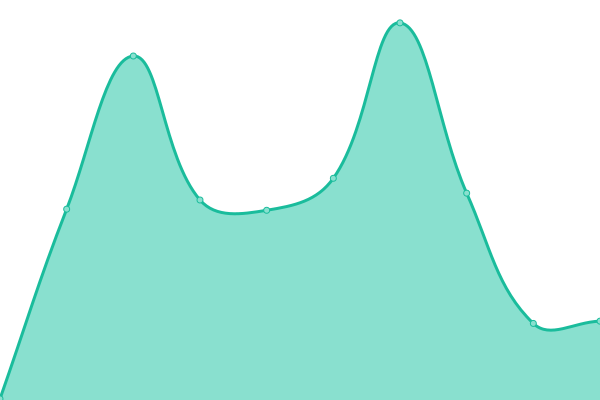
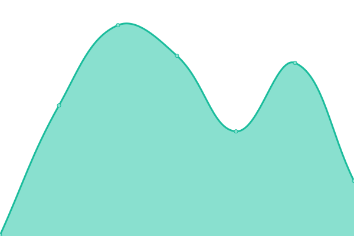
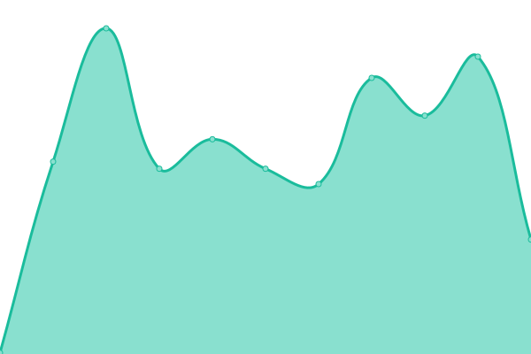

# [📈 Live Status](https://status.hershey.co): <!--live status--> **🟧 Partial outage**

This repository contains the open-source uptime monitor and status page for [Marc Hershey](https://marc.hershey.co), powered by [Upptime](https://github.com/upptime/upptime).

With [Upptime](https://upptime.js.org), you can get your own unlimited and free uptime monitor and status page, powered entirely by a GitHub repository. We use [Issues](https://github.com/marchershey/status/issues) as incident reports, [Actions](https://github.com/marchershey/status/actions) as uptime monitors, and [Pages](https://status.hershey.co) for the status page.

<!--start: status pages-->
<!-- This summary is generated by Upptime (https://github.com/upptime/upptime) -->
<!-- Do not edit this manually, your changes will be overwritten -->
<!-- prettier-ignore -->
| URL | Status | History | Response Time | Uptime |
| --- | ------ | ------- | ------------- | ------ |
|  Home Network | 🟥 Down | [home-network.yml](https://github.com/marchershey/status/commits/HEAD/history/home-network.yml) | 

 193ms
     
 | 

<a href="https://status.hershey.co/history/home-network">0.00%</a>
    

|  Plex Server | 🟩 Up | [plex-server.yml](https://github.com/marchershey/status/commits/HEAD/history/plex-server.yml) | 

 245ms
     
 | 

<a href="https://status.hershey.co/history/plex-server">100.00%</a>
    

|  Request App | 🟥 Down | [request-app.yml](https://github.com/marchershey/status/commits/HEAD/history/request-app.yml) | 

 475ms
     
 | 

<a href="https://status.hershey.co/history/request-app">0.00%</a>
    

|  Radarr | 🟥 Down | [radarr.yml](https://github.com/marchershey/status/commits/HEAD/history/radarr.yml) | 

 250ms
     
 | 

<a href="https://status.hershey.co/history/radarr">0.00%</a>
    

|  Sonarr | 🟩 Up | [sonarr.yml](https://github.com/marchershey/status/commits/HEAD/history/sonarr.yml) | 

 296ms
     
 | 

<a href="https://status.hershey.co/history/sonarr">99.93%</a>
    

|  Download Server | 🟥 Down | [download-server.yml](https://github.com/marchershey/status/commits/HEAD/history/download-server.yml) | 

 257ms
     
 | 

<a href="https://status.hershey.co/history/download-server">0.00%</a>
    

|  Plex Watcher | 🟥 Down | [plex-watcher.yml](https://github.com/marchershey/status/commits/HEAD/history/plex-watcher.yml) | 

 247ms
     
 | 

<a href="https://status.hershey.co/history/plex-watcher">0.00%</a>
    

|  Meal Server | 🟥 Down | [meal-server.yml](https://github.com/marchershey/status/commits/HEAD/history/meal-server.yml) | 

 0ms
     
 | 

<a href="https://status.hershey.co/history/meal-server">0.00%</a>
    

<!--end: status pages-->

[**Visit our status website →**](https://status.hershey.co)

## 📄 License

- Powered by: [Upptime](https://github.com/upptime/upptime)
- Code: [MIT](./LICENSE) © [Anand Chowdhary](https://anandchowdhary.com), supported by [Pabio](https://pabio.com)
- Data in the `./history` directory: [Open Database License](https://opendatacommons.org/licenses/odbl/1-0/)
